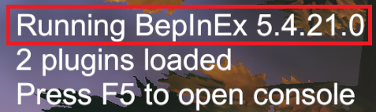
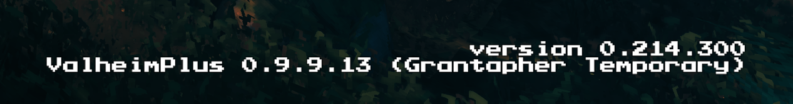

# Installation Instructions

## Useful Links
*These are the links of the temporary home of the mod while the mod owners are unable to update the official repo.*
* [Latest Release on Github](https://github.com/Grantapher/ValheimPlus/releases/latest)
* [Mod on Thunderstore](https://valheim.thunderstore.io/package/Grantapher/ValheimPlus_Grantapher_Temporary/)
* [Mod on Nexus](https://www.nexusmods.com/valheim/mods/2323)

## Client - Automatic Installation

If you want to avoid the headache of manual installation at the cost of downloading a mod manager, I recommend [r2modman](https://valheim.thunderstore.io/package/ebkr/r2modman/), since it will automatically bundle the mod dependency for this mod.

1. Install [r2modman](https://valheim.thunderstore.io/package/ebkr/r2modman/).
2. Select Valheim, select a profile, go to the "online" mods tab, and search "`ValheimPlus_Grantapher_Temporary`"
3. Click it, click "Download", select the latest version, start the game, [verify the title screen](#verify-the-installation), and then quit the game.
    * This will generate a configuration file for you.
4. Configure the mod options, see the [configuring](#configuration) section below.
5. Start the game again, this time for real!

## Manual Installation

### Important exceptions
If any of these sections don't apply to you, skip them.

#### Hosted Server
If your server host automatically installs ValheimPlus for you, there is a good chance it is installing the official version, which is broken with the current Valheim game. In this case, choose one of the installation ZIPs with `Renamed` in the filename.

The only difference is that the mod file has a different filename `ValheimPlusGrantapher.dll`, this is so that it doesn't get overwritten by your server host when it overwrites `ValheimPlus.dll`. Upon loading mods, BepInEx will recognize the two mods are the same and select the one with the newest version (`ValheimPlusGrantapher.dll`).

#### Unix
If you are running the game on Unix, your installation comes with two extra files compared to its Windows counterparts. For details on the additional steps you need to take, search for the text "`Configuration (Linux`" on the [BepInExPack_Valheim page](https://valheim.thunderstore.io/package/denikson/BepInExPack_Valheim/).

### General Instructions
1. Download the appropriate archive from [the latest github release](https://github.com/Grantapher/ValheimPlus/releases/latest).
2. Locate your game folder manually or start your Steam client and right-click the Valheim game. You can then right click the game in your library and select `Manage -> browse local files` for Steam to open your game folder.

    
3. Copy the contents of the zip into the game folder, overwriting any existing files.
4. Configure the mod options, see the [configuring](#configuration) section below.
5. Start the game, [verify the title screen](#verify-the-installation), then exit it.
    * This will generate a configuration file for you.
6. Configure the mod options, see the [configuring](#configuration) section below.
7. Start the game again, this time for real!

## Verify the Installation
The title screen and logs will *mostly* verify that the mod is working before you load into the game.

### Current Version Information

In the current mod release, you should have the following versions:
* Valheim version `0.214.300`
* BepInEx version `5.4.21.0`
  * It is possible for this one to be out of date while having the correct version. `BepInExPack_Valheim` has additional files attached to it, so it may require an update that doesn't advance the BepInEx version.
  * That being said: `BepInExPack_Valheim` version `5.4.2101`
    * Unfortunately, you won't be able to verify this via logs or the title screen.
    * All the github releases come with this version bundled.
    * Thunderstore supports having this dependency and installing it for you via a mod manager.
* ValheimPlus version `0.9.9.13`
  * `(Grantapher Temporary)` will be appended to the title screen (not the log) to signify that it is not the official mod.


### Title Screen
The top left and bottom right corners of the title screen shows BepInEx, Valheim, and ValheimPlus version information. Make sure your version numbers match the [current version information](#current-version-information) above.

Top Left:



Bottom right:



### Logs

When running Valheim with `BepInExPack_Valheim` installed, a log should automatically be opened when you start the game. If not, it can be found at `%USERPROFILE%\AppData\LocalLow\IronGate\Valheim\Player.log` on Windows.

Here are some sample logs that contain version information:

The BepInEx version is generally the first line of the `player.log`
```
[Message:   BepInEx] BepInEx 5.4.21.0 - valheim (3/28/2023 9:32:11 PM)
```

After that, the ValheimPlus version can be found below it.
```
[Info   :   BepInEx] Loading [Valheim Plus 0.9.9.13]
```

```
[Info   :Valheim Plus] ValheimPlus [0.9.9.13] is up to date.
```

Finally, after ValheimPlus has loaded, at some point Valheim itself will log its version.
```
[Info   : Unity Log] 03/28/2023 23:14:38: Valheim version:0.214.304@0.9.9.13
```

ValheimPlus appends that additional `@0.9.9.13` to `0.214.304`. There is no need to be concerned about the last two numbers on `0.214.304`, you can just think of it as `0.214.3`.


## Configuration

Locate the configuration file and edit it with a text editor.

### File Location
|Installation Method|Location
|--|--
|Manual Installation|`<game folder>/BepInEx/config/valheim_plus.cfg`
|R2ModMan|`%APPDATA%/r2modmanPlus-local/Valheim/profiles/<profile_name>/BepInEx/config/valheim_plus.cfg` (replace `<profile_name>` with the name of your profile)
|Thunderstore|`%APPDATA%/Thunderstore Mod Manager/DataFolder/Valheim/profiles/<profile_name>/BepInEx/config/valheim_plus.cfg` (replace `<profile_name>` with the name of your profile)
